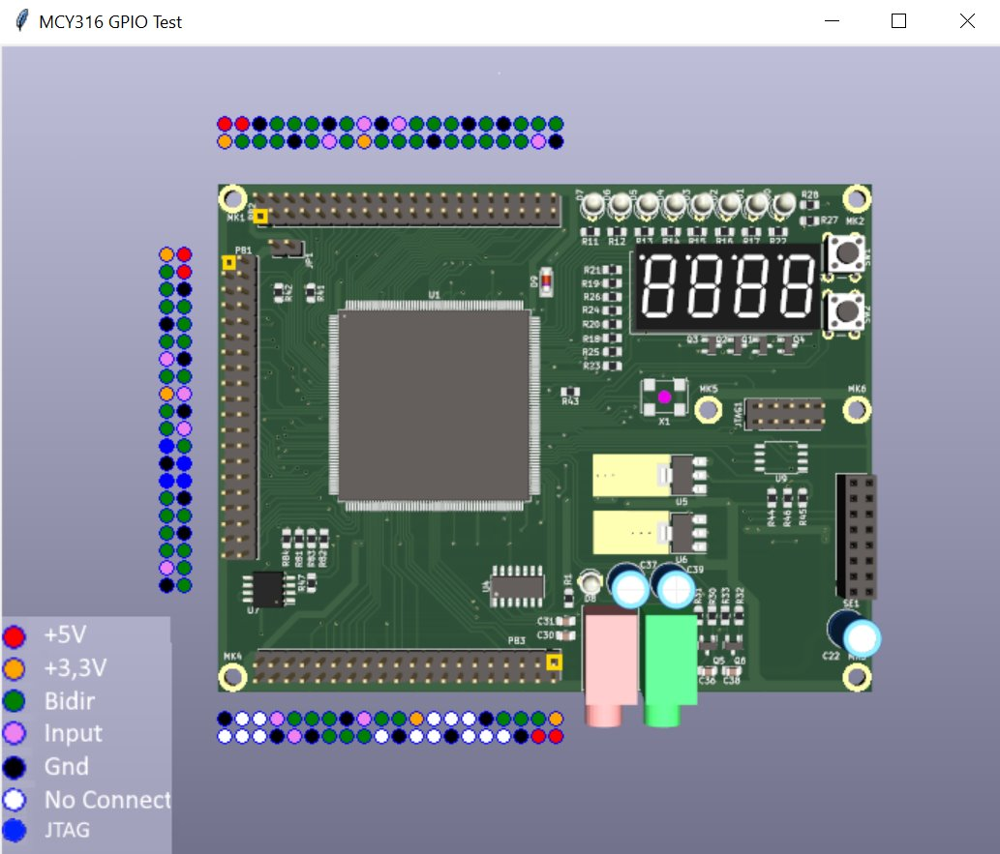

# MCY316 Тест выходов GPIO

Проект FPGA, тест выходов GPIO.
Откомпилируйте проект в среде Altera Quartus Web Edition и загрузите ПЛИС.
Из папки python запустите тестовую управляющую программу:

>python gpio-test.py COM22

здесь COM22 это имя последовательного порта, обычно второй канал программатора MBFTDI.

На экране компьютера появится изображение платы и виртуальные выводы GPIO:

Кликая мышкой по кружочкам изображающим пины можно подавать или снимать сигнал с выходов GPIO платы.

Питоновская программа посылает двухбайтные управляющие пакеты в последовательный порт, чтобы установить или сбросить любой из доступных сигнал GPIO.

Управлять можно только bidir сигналами.
Сигналы на ввод тоже можно проверить этим проектом, но отображаться статус входных сигналов будет на светодиодах платы.

Сигналы JTAG на разёме GPIO зарезервированы для загрузки ПЛИС из распбери, если плата будет подключена к распбери микрокомпьютеру.

